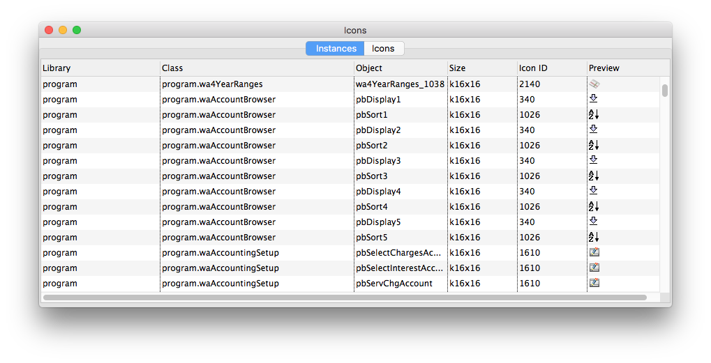
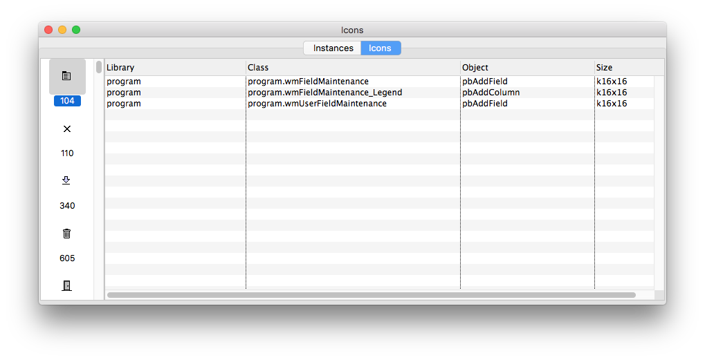

# Find Icons

Find icons will search any open libraries and display a list of `$iconid` values in use.

## Installation
Download [find_icons.lbs](lib/8.1/find_icons.lbs).

## Usage
 1. Open one or more libraries to search
 2. Open `find_icons.lbs`
 3. Wait for the search to complete
 4. Review the results either by a list of instances or a list of icons

 You can double-click an instance to open that window in design mode.

 

 

 ## Credits
 The icon search engine was graciously provided by Rudolf Bagholtz to the Omnis Developer list on October 2017. Alex Clay updated the library to Studio 8.1, added the GUI, and posted it to this page.

 ## Contributions
 Contributions are welcome! Please fork the repository and issue a pull request to merge your changes. Only changes to `src/` are required. The maintainers will rebuild the `.lbs` files when approving the request.